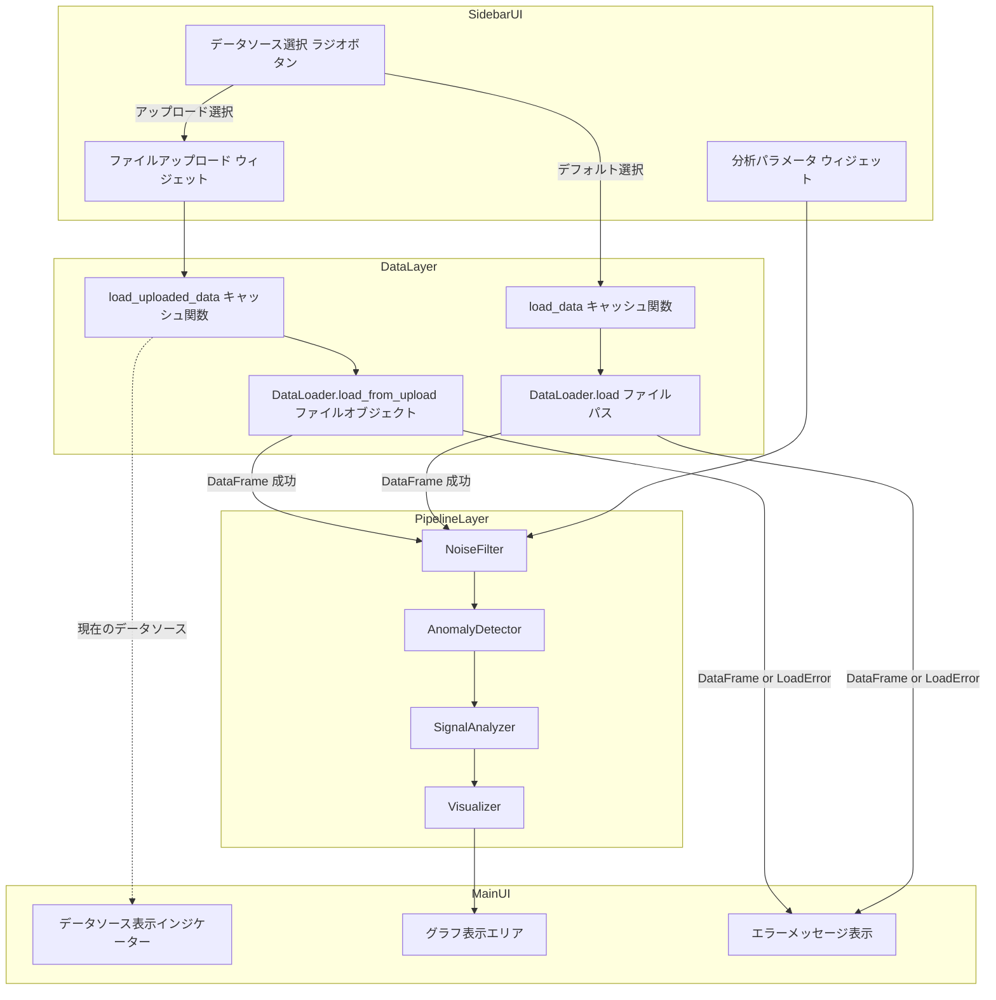
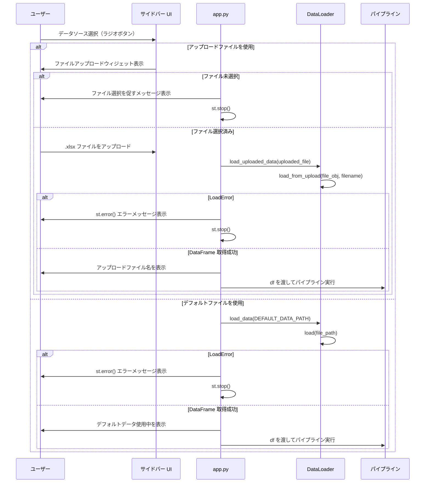
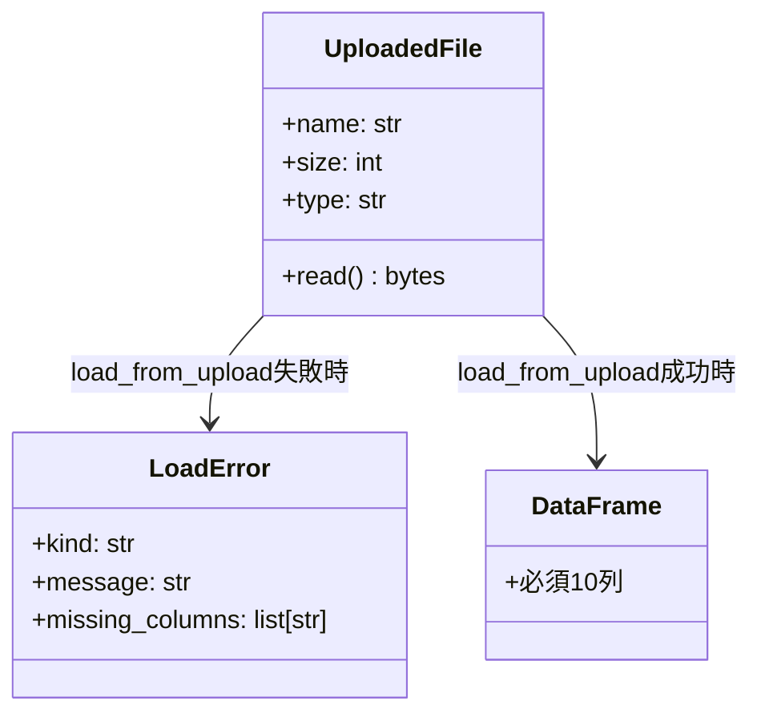
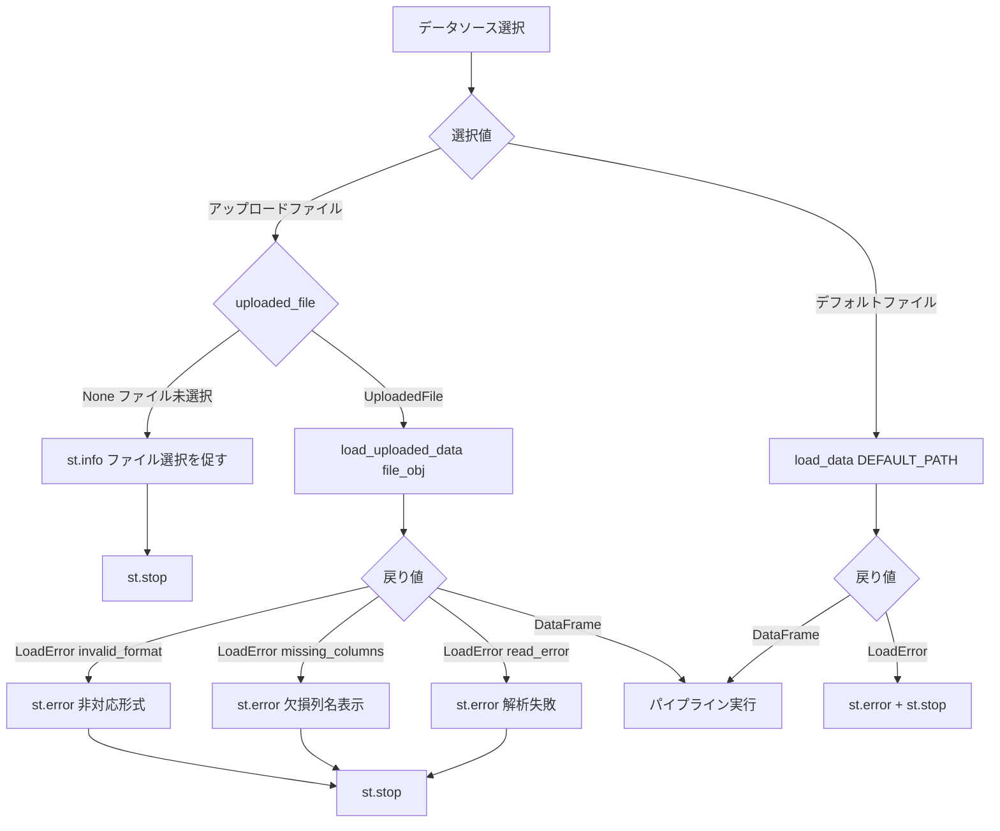

# 設計書: Excel ファイル登録機能

## 概要

本機能は、トロリ線摩耗検測データ分析ツール（5cm チャート分析）に対して、ユーザーが任意の Excel ファイル（`.xlsx`）をブラウザ経由でアップロードして分析パイプラインへ投入できる「Excelファイル登録機能」を追加する。

**目的**: データアナリストが固定サンプルデータに依存することなく、任意の路線・区間の計測データを同一パイプラインで分析できるようにする。

**ユーザー**: データアナリストが Streamlit サイドバーのデータソース選択 UI からアップロードファイルとデフォルトファイルを切り替え、既存の分析パラメータウィジェットと組み合わせて利用する。

**変更内容**: 現在の固定パス読み込み（`data/20220916-koga-st-5cm-original-data.xlsx`）を、データソース選択 → ファイルアップロード → 読み込み・検証 → パイプライン実行の制御フローに置き換える。`DataLoader.load_from_upload()` は既に実装済みであるため、変更対象は `app.py` のみとなる。

### ゴール

- データソース選択 UI（ラジオボタン）とファイルアップロードウィジェットをサイドバーに追加する
- アップロードファイルの読み込み・検証エラーを具体的なメッセージでユーザーに提示する
- アップロード成功時はアップロードデータを既存パイプラインへシームレスに渡す
- 既存の分析パラメータウィジェットの動作を変更しない

### 非ゴール

- サーバー側へのファイル永続化（アップロードデータはセッションメモリのみに保持する）
- `.xls`（旧形式）その他の Excel 形式のサポート
- 複数ファイルの同時アップロード
- ファイルサイズ制限の実装（初期実装では Streamlit デフォルト上限に依存する）
- S3 や外部ストレージとの連携

---

## アーキテクチャ

### 既存アーキテクチャ分析

現在の `app.py` は以下の固定フローで動作している。

1. モジュールトップレベルで `load_data(file_path)` を呼び出す（`@st.cache_data` 付き）
2. `LoadError` の場合は `st.error()` → `st.stop()`
3. 成功時は `df` を取得し、サイドバーウィジェット定義 → パイプライン実行

本機能追加後は、サイドバー UI 定義がデータ取得の前に来る必要がある（データソース選択 → ファイルアップロード UI → データ取得 → 分析パラメータ UI → パイプライン実行）。

既存の依存関係ルール（`app.py` → `src/` 全モジュール）は変更されない。`DataLoader` の変更は不要。

### アーキテクチャパターン & 境界マップ



**アーキテクチャ統合**:
- 選択パターン: `app.py` 内直接修正（Extension パターン）
- 既存パターンの維持: `@st.cache_data` による読み込みキャッシュ、エラーを値として返す `LoadError` パターン、`st.error()` + `st.stop()` によるパイプライン停止
- 新規コンポーネントの根拠: `load_uploaded_data()` キャッシュ関数 — `UploadedFile` オブジェクトを引数に取ることで Streamlit がファイル変更時のキャッシュ自動無効化を処理する
- ステアリング準拠: `app.py` がパイプライン統合のエントリポイントとして機能し、`DataLoader` がエラーを値で返す設計を維持する

### テクノロジースタック

| レイヤー | 選択 / バージョン | 本機能での役割 | 備考 |
|---------|----------------|--------------|------|
| フロントエンド / UI | Streamlit（既存） | `st.radio`、`st.file_uploader`、`st.error`、`st.info` | 既存バージョンをそのまま使用 |
| データレイヤー | pandas 2.x + openpyxl（既存） | `DataLoader.load_from_upload()` 経由でファイルオブジェクトから DataFrame を生成 | 新規ライブラリ追加なし |
| ランタイム | Python 3.10+（既存） | 型ヒント（`from __future__ import annotations`）の継続使用 | 変更なし |

---

## システムフロー

### データソース選択とパイプライン実行フロー



**フロー上の主要判断**:
- データソース選択は Streamlit のリラン特性により、毎回の再実行でウィジェット値が維持される
- `st.stop()` はパイプライン処理（フィルタリング・異常検知・可視化）の実行を完全に停止する
- アップロードウィジェットがクリアされた場合（`uploaded_file is None`）、デフォルトへの自動復帰は行わない（要件 5.4）

---

## 要件トレーサビリティ

| 要件 | サマリー | コンポーネント | インターフェース | フロー |
|------|---------|--------------|----------------|-------|
| 1.1 | データソース選択 UI を表示 | `StreamlitApp`（サイドバー UI） | `st.radio` | データソース選択フロー |
| 1.2 | 初期状態は「アップロードファイル」 | `StreamlitApp` | `st.radio(index=0)` | — |
| 1.3 | アップロード選択時にファイルウィジェット表示 | `StreamlitApp` | `st.file_uploader` | 条件分岐 |
| 1.4 | ウィジェットラベルの日本語テキスト | `StreamlitApp` | `st.file_uploader(label=...)` | — |
| 1.5 | `.xlsx` のみ受付 | `StreamlitApp` + `DataLoader` | `st.file_uploader(type=["xlsx"])` + `load_from_upload` | — |
| 1.6 | デフォルト選択時はデフォルトファイルで実行 | `StreamlitApp` + `load_data` | `load_data(DEFAULT_DATA_PATH)` | デフォルトファイルフロー |
| 1.7 | ファイル未選択時はメッセージ表示・パイプライン停止 | `StreamlitApp` | `st.info()` + `st.stop()` | 未選択ガード |
| 2.1 | `load_from_upload` でファイルオブジェクトから読み込む | `DataLoader`（既存実装） | `load_from_upload(file_obj, filename)` | アップロードフロー |
| 2.2 | 成功時に必須10列を検証 | `DataLoader`（既存実装） | `validate_columns(df)` | — |
| 2.3 | 非 xlsx は `invalid_format` エラー | `DataLoader`（既存実装） | `LoadError(kind="invalid_format")` | — |
| 2.4 | 列欠損は `missing_columns` エラー | `DataLoader`（既存実装） | `LoadError(kind="missing_columns", missing_columns=[...])` | — |
| 2.5 | 解析失敗は `read_error` エラー | `DataLoader`（既存実装） | `LoadError(kind="read_error")` | — |
| 2.6 | 例外を外部に送出しない | `DataLoader`（既存実装） | 戻り値型 `pd.DataFrame \| LoadError` | — |
| 3.1 | `invalid_format` エラー時のメッセージ表示 | `StreamlitApp` | `st.error()` + `st.stop()` | エラーフロー |
| 3.2 | `missing_columns` エラー時は欠損列名を表示 | `StreamlitApp` | `st.error()` + `st.stop()` | エラーフロー |
| 3.3 | `read_error` エラー時のメッセージ表示 | `StreamlitApp` | `st.error()` + `st.stop()` | エラーフロー |
| 3.4 | エラー時にパイプラインを停止 | `StreamlitApp` | `st.stop()` | エラーフロー |
| 3.5 | エラー時は前回の結果を残さない | `StreamlitApp` | `st.stop()` の位置制御 | — |
| 4.1 | 読み込み成功時に既存パイプラインへ df を渡す | `StreamlitApp` + Pipeline | `df → NoiseFilter → AnomalyDetector → ...` | 成功フロー |
| 4.2 | `@st.cache_data` で再読み込み抑制 | `load_uploaded_data` キャッシュ関数 | `@st.cache_data` デコレータ | — |
| 4.3 | 異なるファイル時はキャッシュ無効化 | `load_uploaded_data` キャッシュ関数 | `UploadedFile` オブジェクトのハッシュ変化 | — |
| 4.4 | 既存パラメータウィジェットの動作維持 | `StreamlitApp`（変更なし） | 既存ウィジェット定義を保持 | — |
| 5.1 | デフォルト切替時はデフォルトファイル使用 | `StreamlitApp` | `st.radio` 値による分岐 | データソース切替フロー |
| 5.2 | アップロード選択時の切替挙動 | `StreamlitApp` | `st.radio` 値 + `uploaded_file` の存在確認 | — |
| 5.3 | 現在使用中データソースの表示 | `StreamlitApp` | `st.info()` または `st.caption()` | — |
| 5.4 | ファイルクリア時はデフォルト復帰せずメッセージ表示 | `StreamlitApp` | `st.info()` + `st.stop()` | — |

---

## コンポーネントとインターフェース

### コンポーネントサマリー

| コンポーネント | ドメイン/レイヤー | 意図 | 要件カバレッジ | 主要依存 | コントラクト |
|--------------|---------------|-----|--------------|---------|-----------|
| `StreamlitApp`（`app.py` 拡張） | Presentation Layer | データソース選択 UI・エラー表示・パイプライン制御の統合 | 1.1〜1.7, 3.1〜3.5, 4.1, 4.4, 5.1〜5.4 | `DataLoader` (P0), `load_uploaded_data` (P0) | State |
| `load_uploaded_data` | Presentation Layer（キャッシュ関数） | `UploadedFile` からの DataFrame 取得とキャッシュ管理 | 4.2, 4.3 | `DataLoader.load_from_upload` (P0) | Service |
| `DataLoader`（変更なし） | Data Layer | Excel ファイル読み込み・列検証・エラー値返却 | 2.1〜2.6 | pandas, openpyxl (P0) | Service |

---

### Presentation Layer

#### StreamlitApp（`app.py` 拡張）

| フィールド | 詳細 |
|----------|------|
| 意図 | データソース選択 UI をサイドバーに追加し、選択結果に応じたデータ取得・エラー表示・パイプライン制御を行う |
| 要件 | 1.1, 1.2, 1.3, 1.4, 1.5, 1.6, 1.7, 3.1, 3.2, 3.3, 3.4, 3.5, 4.1, 4.4, 5.1, 5.2, 5.3, 5.4 |

**責務と制約**
- サイドバーの先頭に「データソース選択」ラジオボタンを配置する（既存の「分析パラメータ」ヘッダーの前）
- 「アップロードファイルを使用」選択時のみ `st.file_uploader` を表示する
- ファイル未選択・エラー発生時は `st.stop()` を呼び出してパイプライン以降の処理を完全に停止する
- 現在使用中データソース（アップロードファイル名またはデフォルトデータ）をメインエリアに表示する
- 既存のサイドバーウィジェット（ウィンドウ幅、Z-Score 閾値、フィルタトグル）の定義・動作を変更しない

**依存関係**
- インバウンド: Streamlit ランタイム — ページリランのトリガー（P0）
- アウトバウンド: `load_uploaded_data()` キャッシュ関数 — アップロードデータ取得（P0）
- アウトバウンド: `load_data()` キャッシュ関数（既存） — デフォルトデータ取得（P0）
- アウトバウンド: `NoiseFilter`, `AnomalyDetector`, `SignalAnalyzer`, `Visualizer` — パイプライン実行（P0）

**コントラクト**: State [x]

##### ステート管理

- **状態モデル**:
  - `data_source: str` — ラジオボタンの選択値（`"アップロードファイルを使用"` または `"デフォルトファイルを使用"`）。Streamlit のウィジェットステートとして管理される。
  - `uploaded_file: UploadedFile | None` — `st.file_uploader` の戻り値。ファイル未選択時は `None`。
- **永続化と一貫性**: Streamlit のリラン特性によりセッション内でウィジェット値が維持される。`st.session_state` への明示的な書き込みは不要。
- **並行性戦略**: Streamlit の単一ユーザーセッションモデル。並行アクセスは想定しない。

**実装ノート**
- 統合: サイドバーの既存ヘッダー（`st.sidebar.header("分析パラメータ")`）の前に、データソース選択ブロックを追加する。サイドバーの順序は「データソース選択 → ファイルアップロードウィジェット（条件付き） → 分析パラメータ」とする。
- バリデーション: ファイルアップロードウィジェットの `type=["xlsx"]` はブラウザ側フィルタに過ぎないため、サーバー側の検証は `DataLoader.load_from_upload()` が担う。
- リスク: `st.stop()` はスクリプト実行を中断するため、エラーメッセージ表示の後に呼び出すこと。`st.stop()` より後に記述されたウィジェット定義（分析パラメータウィジェット等）は表示されない点に注意する。このため、分析パラメータウィジェットはデータ取得成功後に定義する順序とする。

---

#### `load_uploaded_data` キャッシュ関数

| フィールド | 詳細 |
|----------|------|
| 意図 | `UploadedFile` オブジェクトを受け取り DataFrame を返す。`@st.cache_data` でキャッシュし、同一ファイルの再読み込みを防ぐ |
| 要件 | 4.2, 4.3, 2.1 |

**責務と制約**
- `DataLoader().load_from_upload(file_obj, file_obj.name)` を呼び出し、戻り値（`pd.DataFrame | LoadError`）をそのまま返す
- `@st.cache_data` デコレータにより、引数の `file_obj`（`UploadedFile`）が同一である間はキャッシュ結果を返す
- ファイルが変更（新しいファイルがアップロード）されると Streamlit が新しい `UploadedFile` オブジェクトを生成するため、キャッシュが自動無効化される（要件 4.3）
- 例外を外部に送出しない（`DataLoader.load_from_upload()` の設計に準拠）

**依存関係**
- インバウンド: `StreamlitApp` — アップロードファイルオブジェクト（P0）
- アウトバウンド: `DataLoader.load_from_upload` — Excel 読み込み・検証（P0）

**コントラクト**: Service [x]

##### サービスインターフェース

```python
@st.cache_data
def load_uploaded_data(file_obj: UploadedFile) -> pd.DataFrame | LoadError:
    """UploadedFile から DataFrame を読み込む（キャッシュ付き）。

    Args:
        file_obj: st.file_uploader の戻り値（UploadedFile オブジェクト）

    Returns:
        成功時: 必須10列を含む pd.DataFrame
        失敗時: LoadError（kind は "invalid_format" / "missing_columns" / "read_error" のいずれか）
    """
```

- 事前条件: `file_obj` は `None` でないこと（呼び出し側で `None` チェックを行う）
- 事後条件: 戻り値は `pd.DataFrame` または `LoadError` のいずれかである
- 不変条件: 例外を外部に送出しない

**実装ノート**
- 統合: `app.py` のモジュールトップレベルに `load_data()` と並列に定義する
- バリデーション: 拡張子チェック・列検証はすべて `DataLoader.load_from_upload()` に委譲する
- リスク: Streamlit の将来バージョンで `UploadedFile` のハッシュ化仕様が変更された場合、`@st.cache_data(hash_funcs={UploadedFile: lambda f: f.file_id})` のように明示指定が必要になる可能性がある

---

### Data Layer

#### DataLoader（変更なし）

| フィールド | 詳細 |
|----------|------|
| 意図 | Excel ファイル読み込み・列検証・エラー値返却（`load_from_upload()` は既に実装済み） |
| 要件 | 2.1, 2.2, 2.3, 2.4, 2.5, 2.6 |

本コンポーネントに対するコード変更はない。`src/data_loader.py` の `load_from_upload()` メソッドは本要件のすべてのエラーパターン（`invalid_format`、`missing_columns`、`read_error`）を既に実装しており、テストカバレッジも完備している。

---

## データモデル

### ドメインモデル

本機能で新たに登場するドメインオブジェクトは `UploadedFile` のみであり、これは Streamlit が提供する外部型である。既存の `LoadError` および `pd.DataFrame` の構造に変更はない。



**ビジネスルールと不変条件**:
- `LoadError.kind` は `"invalid_format"` / `"missing_columns"` / `"read_error"` / `"file_not_found"` のいずれか（文字列）
- `LoadError.missing_columns` は `kind="missing_columns"` の場合のみ空でない
- `LoadError` は `frozen=True` の dataclass であり不変オブジェクト

### データコントラクト

**`load_uploaded_data` ↔ `StreamlitApp` 間のデータ受け渡し**:

| フィールド | 型 | 説明 |
|----------|---|------|
| 入力 | `UploadedFile` | `st.file_uploader` の戻り値 |
| 出力（成功） | `pd.DataFrame` | 必須10列（`REQUIRED_COLUMNS`）を含む DataFrame |
| 出力（失敗） | `LoadError` | `kind` フィールドで種別を識別 |

---

## エラーハンドリング

### エラー戦略

Fail Fast 方針に準拠し、エラーを値オブジェクト（`LoadError`）として受け取った時点で即座に `st.error()` でユーザーに提示し `st.stop()` でパイプラインを停止する。前回のデータによる古い分析結果は `st.stop()` によって自然に消去される。

### エラーカテゴリと応答

| エラー種別 | `LoadError.kind` | 表示メッセージ | パイプライン |
|----------|----------------|-------------|-----------|
| 非対応ファイル形式 | `"invalid_format"` | 「非対応のファイル形式です。.xlsx ファイルを指定してください。」 | `st.stop()` で停止 |
| 必須列欠損 | `"missing_columns"` | 「必須列が不足しています: {欠損列名リスト}」 | `st.stop()` で停止 |
| Excel 解析エラー | `"read_error"` | 「ファイルの読み込みに失敗しました: {メッセージ}」 | `st.stop()` で停止 |
| ファイル未選択 | — | 「分析ファイルを選択してください。」（`st.info()`） | `st.stop()` で停止 |

**エラーフロー可視化**:



### モニタリング

- `DataLoader` 内の `logging.warning` が既存のターミナルログ出力を担う（変更なし）
- `st.error()` の表示内容でユーザーが問題を自己診断できるように具体的なメッセージを提供する

---

## テスト戦略

### ユニットテスト（`tests/test_data_loader.py`、既存テストを流用）

`DataLoader.load_from_upload()` のユニットテストは既に完備しているため、新規追加は不要。既存テストクラスが本要件をカバーする:
- `TestLoadFromUploadInvalidFormat` — 要件 2.3
- `TestLoadFromUploadValidFile` — 要件 2.1、2.2、2.4、2.5、2.6

### ユニットテスト（`tests/test_excel_file_registration.py`、新規）

| テストケース | 検証内容 | 要件 |
|-----------|---------|------|
| `test_load_uploaded_data_returns_dataframe` | 有効な xlsx ファイルオブジェクトで DataFrame が返る | 2.1, 4.2 |
| `test_load_uploaded_data_invalid_format_returns_load_error` | 非 xlsx ファイルで `LoadError(kind="invalid_format")` が返る | 2.3 |
| `test_load_uploaded_data_missing_columns_returns_load_error` | 必須列欠損で `LoadError(kind="missing_columns")` が返る | 2.4 |
| `test_data_source_default_uses_default_path` | デフォルト選択時に `DEFAULT_DATA_PATH` が使用される | 1.6, 5.1 |
| `test_pipeline_receives_dataframe_from_upload` | アップロード DataFrame が NoiseFilter に渡される | 4.1 |

### 統合テスト（`tests/test_app.py` 拡張）

| テストケース | 検証内容 | 要件 |
|-----------|---------|------|
| `test_full_pipeline_with_uploaded_data` | アップロードデータ経由でフルパイプラインが実行できる | 4.1 |
| `test_load_error_propagation_from_upload` | `LoadError` が `StreamlitApp` に正しく伝播する | 3.1〜3.4 |
| `test_existing_parameter_widgets_unaffected` | 既存パラメータウィジェットロジックが変更されていない | 4.4 |

### E2E テスト

- `uv run streamlit run app.py --headless` での起動確認（既存 E2E テストの継続）
- アップロードウィジェットの UI テストは Streamlit の headless モードでは対応不可のため、手動動作確認で代替する

---

## セキュリティ考慮事項

- **ファイル形式の検証**: `st.file_uploader(type=["xlsx"])` のブラウザ側フィルタに加えて、`DataLoader.load_from_upload()` がサーバー側で拡張子チェックを実施する（二重防御）
- **例外封じ込め**: `DataLoader.load_from_upload()` が Excel 解析中の全例外を `LoadError` に変換するため、内部スタックトレースがユーザーに漏洩しない
- **ファイル永続化なし**: アップロードされたファイルはサーバー側に保存されず、メモリ内でのみ処理される

---

## パフォーマンスと拡張性

- **キャッシュ戦略**: `@st.cache_data` により、同一ファイルがアップロードされている間はファイルの再読み込みが発生しない。サイドバーのパラメータ変更時にも DataFrame 取得は再実行されない（要件 4.2）
- **メモリ消費**: アップロードされたデータは `@st.cache_data` のキャッシュに保持される。通常の計測ファイルサイズ（数十 MB 以内）では問題なし

---

## 参照文献

- `research.md`（本フィーチャー）— ディスカバリー調査の詳細と設計判断の背景
- `src/data_loader.py` — `DataLoader.load_from_upload()` の既存実装
- `tests/test_data_loader.py` — `TestLoadFromUploadInvalidFormat` / `TestLoadFromUploadValidFile`
- Streamlit 公式ドキュメント: `st.file_uploader`、`st.cache_data`
