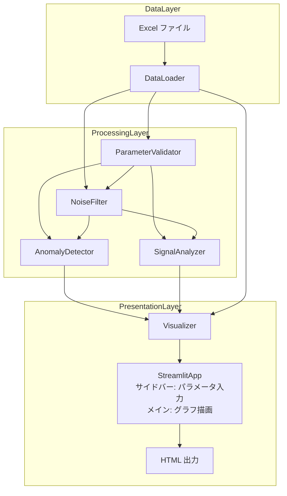
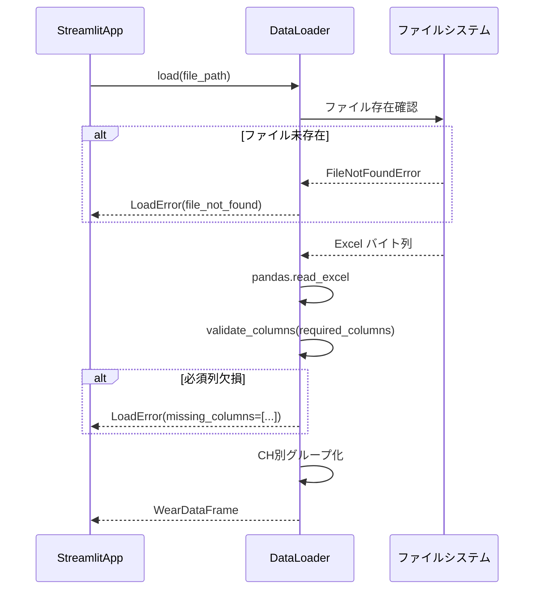
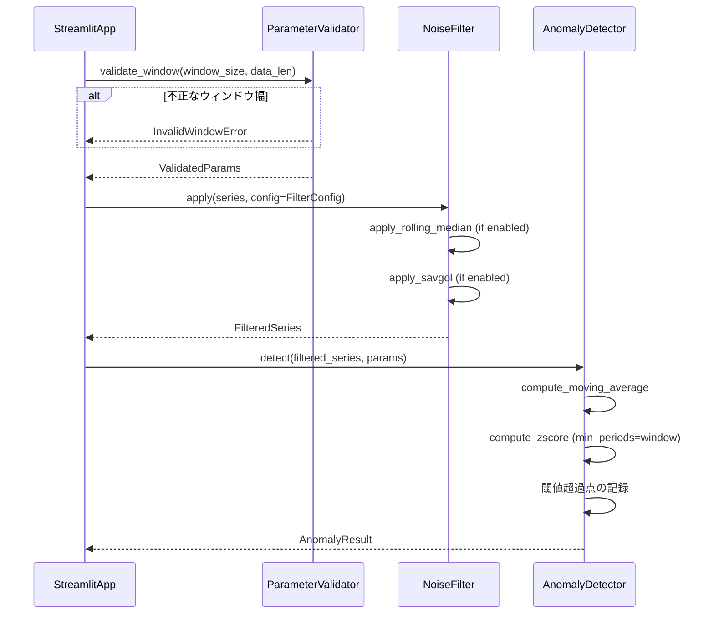
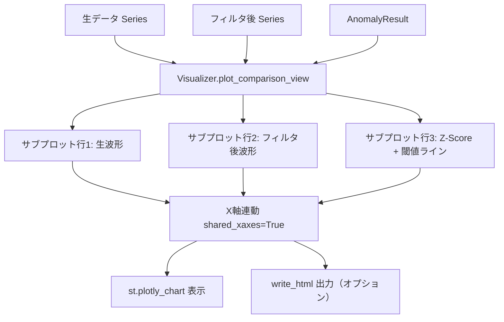

# 設計ドキュメント: トロリ線摩耗検測データ EDA ツール

## Overview

本フィーチャーは、5cm ピッチで計測されたトロリ線残存直径データに対して、探索的データ分析（EDA）を行うツールをデータアナリストに提供する。

**Purpose**: 計測ノイズを含むトロリ線摩耗データから局所的な異常摩耗を定量的に検知し、各処理段階（生データ → フィルタリング → 異常検知）の効果をインタラクティブに可視化する。
**Users**: データアナリストが、Streamlit Web アプリ上でサイドバーのウィジェット（スライダー・トグル等）を使って分析パラメータを対話的に調整しながら利用する。また HTML 出力を通じて結果を第三者と共有できる。ツールは `uv run streamlit run app.py` で起動する。
**Impact**: 既存の手動チャート確認作業を、再現可能・自動化されたパイプライン処理に置き換え、異常箇所の見落としリスクを低減する。

### Goals

- Excel ファイルから計測データを安全に読み込み、必須列の存在を検証する
- CH（1〜4）別インタラクティブチャートによる摩耗分布の視覚的把握
- RMS・FFT・STFT によるスライドウィンドウ信号解析パラメータの探索
- 移動中央値 + Savitzky-Golay フィルタによるノイズ除去効果の確認
- Z-Score に基づく局所的異常摩耗箇所の定量的検知と可視化
- 生波形・フィルタ後波形・Z-Score の連動インタラクティブ比較ビュー

### Non-Goals

- リアルタイムデータ取得・ストリーミング処理
- 要件 7（ファイルアップロード UI）は現フェーズでは設計対象外（将来拡張として設計に拡張点を明示するにとどめる）
- データの永続化・データベース格納
- Jupyter Notebook ファイル（.ipynb）の作成・利用

---

## Requirements Traceability

| 要件 | 概要 | コンポーネント | インターフェース | フロー |
|------|------|---------------|----------------|--------|
| 1.1 | Excelファイル読み込み | DataLoader | `DataLoader.load` | データ読み込みフロー |
| 1.2 | 必須列の検証 | DataLoader | `DataLoader.validate_columns` | データ読み込みフロー |
| 1.3 | ファイル未存在エラー | DataLoader | `DataLoader.load` — FileNotFoundError | データ読み込みフロー |
| 1.4 | 欠損列エラー | DataLoader | `DataLoader.validate_columns` — ColumnMissingError | データ読み込みフロー |
| 1.5 | CH別グループ化 | DataLoader | `DataLoader.get_channel_group` | — |
| 2.1 | CH別グラフ生成 | Visualizer | `Visualizer.plot_channels` | CH別可視化フロー |
| 2.2 | 横軸キロ程・縦軸摩耗値 | Visualizer | `Visualizer.plot_channels` | CH別可視化フロー |
| 2.3 | ホバーツールチップ | Visualizer | `Visualizer.build_hover_template` | CH別可視化フロー |
| 2.4 | ズーム/パン | Visualizer | Plotly 標準機能 | — |
| 2.5 | 全CH確認 | Visualizer | `Visualizer.plot_channels` | CH別可視化フロー |
| 3.1 | ウィンドウ幅パラメータ | ParameterValidator | `ParameterValidator.validate_window` | 信号解析フロー |
| 3.2 | RMS処理 | SignalAnalyzer | `SignalAnalyzer.compute_rms` | 信号解析フロー |
| 3.3 | FFT処理 | SignalAnalyzer | `SignalAnalyzer.compute_fft` | 信号解析フロー |
| 3.4 | STFT処理 | SignalAnalyzer | `SignalAnalyzer.compute_stft` | 信号解析フロー |
| 3.5 | RMS/FFT/STFT結果の可視化 | Visualizer | `Visualizer.plot_analysis_results` | 信号解析フロー |
| 3.6 | ウィンドウ幅バリデーション | ParameterValidator | `ParameterValidator.validate_window` — InvalidWindowError | 信号解析フロー |
| 4.1 | 移動中央値フィルタ | NoiseFilter | `NoiseFilter.apply_rolling_median` | フィルタリングフロー |
| 4.2 | Savitzky-Golayフィルタ | NoiseFilter | `NoiseFilter.apply_savgol` | フィルタリングフロー |
| 4.3 | 移動中央値ON/OFF | NoiseFilter | `FilterConfig.median_enabled` | フィルタリングフロー |
| 4.4 | Savitzky-GolayON/OFF | NoiseFilter | `FilterConfig.savgol_enabled` | フィルタリングフロー |
| 4.5 | 両フィルタ適用順序 | NoiseFilter | `NoiseFilter.apply` | フィルタリングフロー |
| 4.6 | フィルタOFF時は元データ通過 | NoiseFilter | `NoiseFilter.apply` | フィルタリングフロー |
| 4.7 | フィルタ前後比較グラフ | Visualizer | `Visualizer.plot_filter_comparison` | フィルタリングフロー |
| 5.1 | 移動平均算出 | AnomalyDetector | `AnomalyDetector.compute_moving_average` | 異常検知フロー |
| 5.2 | Z-Score算出 | AnomalyDetector | `AnomalyDetector.compute_zscore` | 異常検知フロー |
| 5.3 | Z-Score閾値パラメータ | ParameterValidator | `ParameterValidator.validate_threshold` | 異常検知フロー |
| 5.4 | 異常箇所の記録 | AnomalyDetector | `AnomalyDetector.detect` | 異常検知フロー |
| 5.5 | 異常箇所のグラフハイライト | Visualizer | `Visualizer.plot_anomaly_overlay` | 異常検知フロー |
| 5.6 | データ点不足時のNaN処理 | AnomalyDetector | `AnomalyDetector.compute_zscore` — min_periods=window | 異常検知フロー |
| 6.1 | 3段サブプロット | Visualizer | `Visualizer.plot_comparison_view` | 統合比較ビューフロー |
| 6.2 | X軸連動 | Visualizer | `make_subplots(shared_xaxes=True)` | 統合比較ビューフロー |
| 6.3 | 閾値ライン表示 | Visualizer | `Visualizer.plot_comparison_view` | 統合比較ビューフロー |
| 6.4 | ホバーツールチップ（比較ビュー） | Visualizer | `Visualizer.build_hover_template` | 統合比較ビューフロー |
| 6.5 | HTML/Notebook出力 | Visualizer | `Visualizer.export_html` | 統合比較ビューフロー |
| 7.1〜7.4 | ファイルアップロード（将来拡張） | DataLoader（拡張点） | `DataLoader.load` の入力抽象化 | — |

---

## Architecture

### Architecture Pattern & Boundary Map

本フィーチャーは **パイプラインアーキテクチャ** を採用する。各コンポーネントが単一の変換責任を持ち、前段の出力を後段の入力として渡す直列構成とする。



**Architecture Integration**:
- 採用パターン: Pipeline（直列変換パイプライン）。EDA ユースケースでは各段階の処理が明確に順序付けられており、パイプラインが最適
- 境界分離: データ読み込み / 処理 / 可視化の 3 レイヤーで責務を分離し、各コンポーネントが独立してテスト可能
- 起動方式: `uv run streamlit run app.py` で起動。Streamlit がサイドバーにウィジェット（スライダー・トグル）を提供し、パラメータ変更のたびにパイプラインを再実行する
- 将来拡張: DataLoader を抽象化し、要件 7 のファイルアップロード機能（`st.file_uploader`）を追加する際にも既存パイプラインコードを変更せず拡張できる
- Steering 準拠: グリーンフィールドのため既存パターンとの衝突なし

### Technology Stack

| レイヤー | ライブラリ / バージョン | 役割 | 備考 |
|----------|------------------------|------|------|
| パッケージ管理 | uv | 依存関係管理・アプリ起動（`uv run streamlit run app.py`） | pyproject.toml で依存を管理 |
| ランタイム | Python 3.10+ | 分析スクリプト・モジュール実行環境 | SageMaker Studio 環境と整合 |
| データ操作 | pandas 2.x | DataFrame による計測データ管理、ローリング統計 | openpyxl バックエンドで Excel 読み込み |
| 数値計算 | NumPy 1.26+ | FFT（`numpy.fft.rfft`）、配列演算 | pandas 依存として自動導入 |
| 信号処理 | SciPy 1.17.1 | `savgol_filter`、`stft` によるフィルタリング・周波数解析 | 最新安定版 |
| 可視化 | Plotly 6.5.0 | インタラクティブチャート、連動サブプロット、HTML 出力 | `make_subplots(shared_xaxes=True)` を活用 |
| UI フレームワーク | Streamlit | サイドバーウィジェット（スライダー・トグル）によるパラメータ対話操作、`st.plotly_chart` でグラフ描画 | `uv run streamlit run app.py` で起動 |

---

## System Flows

### データ読み込みフロー



### フィルタリング → 異常検知フロー



### 統合比較ビューフロー



---

## Components and Interfaces

### コンポーネント概要

| コンポーネント | レイヤー | 役割 | 要件カバレッジ | 主要依存 | コントラクト |
|---|---|---|---|---|---|
| DataLoader | Data | Excel読み込み・列検証・CH分割 | 1.1〜1.5 | pandas, openpyxl (P0) | Service |
| ParameterValidator | Processing | ウィンドウ幅・閾値のバリデーション | 3.1, 3.6, 5.3 | — (P0) | Service |
| NoiseFilter | Processing | 移動中央値・SG フィルタの適用 | 4.1〜4.6 | pandas, SciPy (P0) | Service, State |
| SignalAnalyzer | Processing | RMS・FFT・STFT 算出 | 3.2〜3.4 | NumPy, SciPy (P0) | Service |
| AnomalyDetector | Processing | Z-Score 算出・異常点記録 | 5.1〜5.6 | pandas (P0) | Service |
| Visualizer | Presentation | インタラクティブグラフ生成・出力 | 2.1〜2.5, 3.5, 4.7, 5.5, 6.1〜6.5 | Plotly (P0) | Service |

---

### Data Layer

#### DataLoader

| フィールド | 詳細 |
|-----------|------|
| Intent | Excel ファイルの読み込み・必須列検証・CH 別 DataFrame の提供 |
| Requirements | 1.1, 1.2, 1.3, 1.4, 1.5 |

**Responsibilities & Constraints**
- `data/20220916-koga-st-5cm-original-data.xlsx` を `pandas.read_excel` で読み込む
- 必須列 10 項目（`キロ程`, `摩耗_測定値`, `CH`, `箇所名`, `通称線名名称`, `駅・駅々間名称`, `電柱番号`, `架線構造名`, `トロリ線種`, `降雨フラグ`）の存在を検証する
- `CH` 列（値域 1〜4）で DataFrame をグループ化し、個別 DataFrame として返す
- データの内容変換（フィルタリング・計算）は行わない — 読み込み・検証・分割のみ

**Dependencies**
- External: pandas 2.x + openpyxl — Excel 読み込みバックエンド (P0)

**Contracts**: Service [x]

##### Service Interface

```python
from __future__ import annotations
from dataclasses import dataclass
from typing import Optional
import pandas as pd

REQUIRED_COLUMNS: list[str] = [
    "キロ程", "摩耗_測定値", "CH", "箇所名", "通称線名名称",
    "駅・駅々間名称", "電柱番号", "架線構造名", "トロリ線種", "降雨フラグ",
]

@dataclass(frozen=True)
class LoadError:
    kind: str  # "file_not_found" | "missing_columns" | "read_error"
    message: str
    missing_columns: list[str] = ()

class DataLoader:
    def load(self, file_path: str) -> pd.DataFrame | LoadError:
        """
        Excelファイルを読み込み WearDataFrame を返す。
        エラー時は LoadError を返す（例外を送出しない）。
        """
        ...

    def validate_columns(self, df: pd.DataFrame) -> Optional[LoadError]:
        """
        必須列の存在を検証する。欠損があれば LoadError(kind="missing_columns") を返す。
        """
        ...

    def get_channel_group(self, df: pd.DataFrame, ch: int) -> pd.DataFrame:
        """
        CH 列の値でフィルタリングした DataFrame を返す。ch は 1〜4 の整数。
        """
        ...
```

- Preconditions: `file_path` は非空文字列
- Postconditions: 成功時は必須列をすべて含む `pd.DataFrame` を返す
- Invariants: 返却 DataFrame は元の行順を保持する

**Implementation Notes**
- Integration: `pandas.read_excel(file_path, engine="openpyxl")` を使用。エンコーディング問題が発生した場合は `encoding_errors="replace"` を試行する（詳細は `research.md` 参照）
- Validation: 列検証は `set(required) - set(df.columns)` で差分を取り、空でなければエラーとする
- Risks: 大容量ファイルではメモリ使用量が増大する可能性がある（将来は `chunksize` 対応を検討）

---

### Processing Layer

#### ParameterValidator

| フィールド | 詳細 |
|-----------|------|
| Intent | ウィンドウ幅・閾値等のユーザ入力パラメータを一元的に検証する |
| Requirements | 3.1, 3.6, 5.3 |

**Responsibilities & Constraints**
- ウィンドウ幅が `1 <= window_size <= len(data)` を満たすことを検証する
- Z-Score 閾値が正の実数であることを検証する
- Savitzky-Golay フィルタのウィンドウ幅が奇数であることを保証する（偶数の場合は +1 補正）
- 無効値の場合は処理を中断し警告を発する

**Dependencies**
- 依存なし（純粋なバリデーションロジック）

**Contracts**: Service [x]

##### Service Interface

```python
from __future__ import annotations
from dataclasses import dataclass

@dataclass(frozen=True)
class InvalidWindowError:
    window_size: int
    data_length: int
    message: str

@dataclass(frozen=True)
class InvalidThresholdError:
    threshold: float
    message: str

@dataclass(frozen=True)
class ValidatedParams:
    window_size: int          # バリデーション済みウィンドウ幅（奇数補正済み）
    zscore_threshold: float   # バリデーション済み Z-Score 閾値
    polyorder: int            # SG フィルタ多項式次数（デフォルト 2）

class ParameterValidator:
    def validate_window(
        self,
        window_size: int,
        data_length: int,
    ) -> int | InvalidWindowError:
        """
        ウィンドウ幅を検証し、有効であれば検証済み値を返す。
        """
        ...

    def validate_threshold(
        self,
        threshold: float,
    ) -> float | InvalidThresholdError:
        """
        Z-Score 閾値を検証し、有効であれば検証済み値を返す。
        """
        ...

    def ensure_odd_window(self, window_size: int) -> int:
        """
        ウィンドウ幅が偶数の場合は +1 して奇数に補正して返す。
        """
        ...
```

- Preconditions: `data_length > 0`
- Postconditions: 有効値の場合は補正済み整数/浮動小数点数を返す
- Invariants: 返却値は常に `1 <= result <= data_length` を満たす（ウィンドウの場合）

---

#### NoiseFilter

| フィールド | 詳細 |
|-----------|------|
| Intent | 移動中央値フィルタおよび Savitzky-Golay フィルタを ON/OFF 制御付きで適用する |
| Requirements | 4.1, 4.2, 4.3, 4.4, 4.5, 4.6 |

**Responsibilities & Constraints**
- フィルタ適用順序: 移動中央値 → Savitzky-Golay（両方 ON の場合は要件 4.5）
- 両フィルタが OFF の場合は入力 Series をそのまま返す
- Savitzky-Golay フィルタのウィンドウ幅は `ParameterValidator.ensure_odd_window` で補正済みの値を受け取る

**Dependencies**
- Inbound: ParameterValidator — ウィンドウ幅の補正済み値 (P0)
- External: pandas 2.x — `rolling().median()` (P0)
- External: SciPy 1.17.1 — `scipy.signal.savgol_filter` (P0)

**Contracts**: Service [x], State [x]

##### Service Interface

```python
from __future__ import annotations
from dataclasses import dataclass, field
import pandas as pd

@dataclass(frozen=True)
class FilterConfig:
    median_enabled: bool = True
    median_window: int = 5
    savgol_enabled: bool = True
    savgol_window: int = 11   # 必ず奇数（ParameterValidator 補正済み）
    savgol_polyorder: int = 2

@dataclass(frozen=True)
class FilterResult:
    original: pd.Series
    filtered: pd.Series
    config: FilterConfig

class NoiseFilter:
    def apply(self, series: pd.Series, config: FilterConfig) -> FilterResult:
        """
        FilterConfig に従いフィルタを適用する。両方 OFF の場合は original == filtered。
        """
        ...

    def apply_rolling_median(
        self, series: pd.Series, window: int
    ) -> pd.Series:
        """
        移動中央値フィルタを適用する。min_periods=1。
        """
        ...

    def apply_savgol(
        self,
        series: pd.Series,
        window: int,
        polyorder: int,
    ) -> pd.Series:
        """
        Savitzky-Golay フィルタを適用する。
        window は奇数が保証されている前提。
        """
        ...
```

##### State Management

- State model: `FilterConfig` は不変（frozen dataclass）。状態を持たず入力に対して純粋関数的に動作する
- Persistence: なし（揮発性）
- Concurrency strategy: 状態なし、スレッドセーフ

**Implementation Notes**
- Integration: `pd.Series.rolling(window, min_periods=1, center=True).median()` で移動中央値を計算する
- Validation: `savgol_filter` 呼び出し前に `window > polyorder` であることを確認する
- Risks: SG フィルタの `polyorder >= window_length` はエラーになる。`ParameterValidator` でウィンドウ幅 > 多項式次数を強制する

---

#### SignalAnalyzer

| フィールド | 詳細 |
|-----------|------|
| Intent | 指定ウィンドウ幅での RMS・FFT・STFT 信号解析を実行する |
| Requirements | 3.2, 3.3, 3.4 |

**Responsibilities & Constraints**
- 入力 Series はフィルタ処理後のデータを受け取る
- ウィンドウ幅は `ParameterValidator` で検証済みの値を受け取る
- FFT は `numpy.fft.rfft`（実数入力専用）を使用し、周波数軸を `rfftfreq(n, d=0.05)` で計算する（5cm = 0.05m ピッチ）
- STFT は `scipy.signal.stft` を使用する

**Dependencies**
- Inbound: ParameterValidator — 検証済みウィンドウ幅 (P0)
- External: NumPy 1.26+ — `numpy.fft.rfft`, `rfftfreq` (P0)
- External: SciPy 1.17.1 — `scipy.signal.stft` (P0)
- External: pandas 2.x — `rolling().apply()` (P0)

**Contracts**: Service [x]

##### Service Interface

```python
from __future__ import annotations
from dataclasses import dataclass
import numpy as np
import pandas as pd

@dataclass(frozen=True)
class RMSResult:
    rms_series: pd.Series   # ウィンドウごとの RMS 値

@dataclass(frozen=True)
class FFTResult:
    frequencies: np.ndarray   # 周波数軸 (m^-1)
    amplitudes: np.ndarray    # 振幅スペクトル

@dataclass(frozen=True)
class STFTResult:
    frequencies: np.ndarray   # 周波数軸 (m^-1)
    positions: np.ndarray     # キロ程軸 (m)
    spectrogram: np.ndarray   # 2D 振幅スペクトル [freq x position]

class SignalAnalyzer:
    SAMPLE_SPACING_M: float = 0.05  # 5cm ピッチ

    def compute_rms(
        self, series: pd.Series, window_size: int
    ) -> RMSResult:
        """
        スライドウィンドウ RMS を算出する。
        """
        ...

    def compute_fft(
        self, series: pd.Series, window_size: int
    ) -> FFTResult:
        """
        指定ウィンドウ長の FFT を算出する。rfft を使用。
        """
        ...

    def compute_stft(
        self,
        series: pd.Series,
        window_size: int,
    ) -> STFTResult:
        """
        STFT を算出する。scipy.signal.stft を使用。
        """
        ...
```

- Preconditions: `window_size >= 1`、`len(series) >= window_size`
- Postconditions: 各結果オブジェクトは NaN を含まない（端部処理済み）
- Invariants: `FFTResult.frequencies` の長さは `window_size // 2 + 1`

**Implementation Notes**
- Integration: RMS は `pd.Series.rolling(window_size).apply(lambda x: np.sqrt(np.mean(x**2)))` で計算
- Risks: 大きなウィンドウ幅と長い Series の組み合わせでメモリ圧迫の可能性。STFT の `nperseg=window_size` として渡す

---

#### AnomalyDetector

| フィールド | 詳細 |
|-----------|------|
| Intent | Z-Score に基づく局所的異常摩耗点の検出・記録 |
| Requirements | 5.1, 5.2, 5.3, 5.4, 5.5, 5.6 |

**Responsibilities & Constraints**
- 入力はフィルタ処理後の Series
- 移動平均を算出した後、各点の Z-Score（`(x - μ) / σ`）を算出する
- `min_periods=window_size` によりウィンドウが満たない区間は NaN とする（要件 5.6）
- 閾値超過点を `AnomalyResult` に記録する

**Dependencies**
- Inbound: ParameterValidator — 検証済みウィンドウ幅・閾値 (P0)
- External: pandas 2.x — `rolling().mean()`, `rolling().std()` (P0)

**Contracts**: Service [x]

##### Service Interface

```python
from __future__ import annotations
from dataclasses import dataclass
import pandas as pd
import numpy as np

@dataclass(frozen=True)
class AnomalyResult:
    zscore_series: pd.Series           # 全点の Z-Score（NaN 含む）
    moving_average: pd.Series         # 移動平均
    anomaly_indices: pd.Index          # 閾値超過点のインデックス
    anomaly_positions: pd.Series       # 閾値超過点のキロ程値
    threshold: float

class AnomalyDetector:
    def compute_moving_average(
        self, series: pd.Series, window_size: int
    ) -> pd.Series:
        """
        移動平均を算出する。min_periods=window_size。
        """
        ...

    def compute_zscore(
        self,
        series: pd.Series,
        window_size: int,
    ) -> pd.Series:
        """
        移動平均からの Z-Score を算出する。
        ウィンドウ満たない区間は NaN。
        """
        ...

    def detect(
        self,
        series: pd.Series,
        window_size: int,
        threshold: float,
    ) -> AnomalyResult:
        """
        Z-Score が閾値を超えた点を異常箇所として返す。
        """
        ...
```

- Preconditions: `threshold > 0`、`window_size >= 2`（標準偏差算出に最低2点必要）
- Postconditions: `AnomalyResult.anomaly_indices` は `zscore_series` のサブセット
- Invariants: `zscore_series` の長さは入力 `series` と等しい

**Implementation Notes**
- Integration: `rolling(window_size, min_periods=window_size).mean()` と `.std()` で移動統計量を算出し、`(series - mean) / std` で Z-Score を計算する
- Validation: `std == 0` の区間では除算エラーを防ぐため NaN を返す
- Risks: 標準偏差がほぼゼロの均一区間でZ-Scoreが不安定になる。ゼロ除算ガードを必ず実装する

---

### Presentation Layer

#### Visualizer

| フィールド | 詳細 |
|-----------|------|
| Intent | 全グラフ（CH別、比較ビュー、信号解析結果）のインタラクティブ可視化と出力 |
| Requirements | 2.1, 2.2, 2.3, 2.4, 2.5, 3.5, 4.7, 5.5, 6.1, 6.2, 6.3, 6.4, 6.5 |

**Responsibilities & Constraints**
- CH 別チャートでは `go.Scatter` の `hovertemplate` に要件 2.3 の 8 項目を含める
- 統合比較ビューは `make_subplots(rows=3, cols=1, shared_xaxes=True)` で構成する
- HTML 出力は `fig.write_html(output_path)` で行う
- グラフの軸ラベルは日本語を使用する

**Dependencies**
- Inbound: DataLoader — CH 別 DataFrame (P0)
- Inbound: NoiseFilter — FilterResult (P0)
- Inbound: AnomalyDetector — AnomalyResult (P0)
- Inbound: SignalAnalyzer — RMSResult, FFTResult, STFTResult (P1)
- External: Plotly 6.5.0 — `plotly.graph_objects`, `plotly.subplots.make_subplots` (P0)

**Contracts**: Service [x]

##### Service Interface

```python
from __future__ import annotations
from dataclasses import dataclass
import plotly.graph_objects as go
import pandas as pd

@dataclass(frozen=True)
class VisualizerConfig:
    output_dir: str = "output"
    default_height_px: int = 400   # 1グラフあたりの高さ

class Visualizer:
    def plot_channels(
        self,
        channel_data: dict[int, pd.DataFrame],
        config: VisualizerConfig,
    ) -> go.Figure:
        """
        CH 1〜4 の摩耗チャートを生成する。
        各 CH を個別サブプロットまたは切り替えタブとして表示。
        """
        ...

    def plot_filter_comparison(
        self,
        filter_result: "FilterResult",
        kilometric_series: pd.Series,
        config: VisualizerConfig,
    ) -> go.Figure:
        """
        フィルタ前後の波形を重ねた比較グラフを生成する（要件 4.7）。
        """
        ...

    def plot_analysis_results(
        self,
        rms_result: "RMSResult",
        fft_result: "FFTResult",
        stft_result: "STFTResult",
        config: VisualizerConfig,
    ) -> go.Figure:
        """
        RMS・FFT・STFT の結果をグラフ化する（要件 3.5）。
        """
        ...

    def plot_comparison_view(
        self,
        raw_series: pd.Series,
        filtered_series: pd.Series,
        anomaly_result: "AnomalyResult",
        kilometric_series: pd.Series,
        config: VisualizerConfig,
    ) -> go.Figure:
        """
        生波形・フィルタ後波形・Z-Scoreの3段連動サブプロットを生成する（要件 6.1〜6.4）。
        """
        ...

    def build_hover_template(self, df: pd.DataFrame) -> str:
        """
        要件 2.3 で定義された 8 項目のホバーテンプレート文字列を構築する。
        """
        ...

    def export_html(
        self,
        fig: go.Figure,
        filename: str,
        config: VisualizerConfig,
    ) -> str:
        """
        図を HTML ファイルとして保存し、出力パスを返す（要件 6.5）。
        """
        ...
```

- Preconditions: 入力 DataFrame は必須列をすべて含む
- Postconditions: `export_html` は書き込んだファイルの絶対パスを返す。Streamlit 側では `st.plotly_chart(fig, use_container_width=True)` で描画する
- Invariants: `plot_comparison_view` の 3 サブプロットは X 軸（キロ程）を共有する

**Implementation Notes**
- Integration: `make_subplots(rows=3, cols=1, shared_xaxes=True, vertical_spacing=0.04)` を使用。閾値ラインは `go.Scatter(mode="lines", line=dict(dash="dash"))` で描画する
- Streamlit 連携: `Visualizer` が返す `go.Figure` を `StreamlitApp` が `st.plotly_chart` に渡す。`Visualizer` 自身は Streamlit に依存しない（プレゼンテーション層の責務分離）
- Validation: 入力 Series の長さが一致しない場合は `ValueError` を発生させる
- Risks: 日本語ラベルのフォント依存。環境によっては文字化けが発生する可能性があるため、フォント設定を `fig.update_layout(font=dict(family="Meiryo, sans-serif"))` で明示する

---

## Data Models

### Domain Model

本フィーチャーのデータは計測時系列データであり、永続ストレージを持たない。

- **WearDataFrame**: `pd.DataFrame` — キロ程 × 計測値の計測レコード集合
- **FilteredSeries**: `pd.Series` — フィルタ適用後の摩耗測定値系列
- **AnomalyResult**: Z-Score 系列および閾値超過インデックスを持つ値オブジェクト
- 全データは揮発性（Notebook セッション内のみ保持）

### Logical Data Model

**WearDataFrame スキーマ**:

| 列名 | 型 | 説明 |
|------|----|------|
| `キロ程` | `float64` | 計測位置（メートル単位） |
| `摩耗_測定値` | `float64` | 残存直径（mm） |
| `CH` | `int64` | 計測チャンネル（1〜4） |
| `箇所名` | `str` | 設備箇所名 |
| `通称線名名称` | `str` | 線名称 |
| `駅・駅々間名称` | `str` | 駅間名称 |
| `電柱番号` | `str` | 電柱番号 |
| `架線構造名` | `str` | 架線構造 |
| `トロリ線種` | `str` | トロリ線の種別 |
| `降雨フラグ` | `str` | 降雨状態フラグ |

**Consistency & Integrity**:
- `CH` 列は 1〜4 の整数値のみ許容する（DataLoader の `get_channel_group` で暗黙的に保証）
- `キロ程` および `摩耗_測定値` は数値型で非 NaN であることを期待するが、読み込み後の検証は実装時の判断とする

### Data Contracts & Integration

本フィーチャーはモジュール間をメモリ上の Python オブジェクト（`pd.DataFrame`, `pd.Series`, frozen dataclass）で受け渡す。外部 API・イベント・データベースへのシリアライズは発生しない。

唯一の外部出力は `Visualizer.export_html` が生成する HTML ファイルである。

---

## Error Handling

### Error Strategy

早期失敗（Fail Fast）を基本方針とし、ユーザに具体的な対処方法を示すエラーメッセージを出力する。例外を送出せず、エラー値オブジェクトを返すパターンを `DataLoader` と `ParameterValidator` に採用する。

### Error Categories and Responses

**ユーザエラー（入力値問題）**:
- ファイル未存在 → `LoadError(kind="file_not_found")` を返し、正しいパスを示すメッセージを出力
- 必須列欠損 → `LoadError(kind="missing_columns", missing_columns=[...])` で欠損列名を列挙
- 不正ウィンドウ幅 → `InvalidWindowError` を返し、有効範囲を明示（「1 以上 {data_length} 以下」）
- 不正閾値 → `InvalidThresholdError` を返し、正の実数を指定するよう案内

**システム/データエラー**:
- SG フィルタ `polyorder >= window_length` → `ParameterValidator.ensure_odd_window` で事前阻止。突破時は `ValueError` をキャッチしてメッセージ付きで再送出
- Z-Score 計算時のゼロ除算 → NaN を返し、下流で無視する

**ビジネスロジックエラー**:
- CH 値が 1〜4 範囲外 → `get_channel_group` で空の DataFrame を返し、Notebook 側でログに残す

### Monitoring

本ツールは Streamlit アプリとして動作するため、エラー・警告は `st.error()` / `st.warning()` で UI 上に表示する。処理ログは `logging.warning` でターミナル（`uv run` の標準出力）に出力する。外部モニタリング基盤は対象外。

---

## Testing Strategy

### Unit Tests

- `DataLoader.validate_columns`: 必須列が揃っている場合・欠損がある場合・全欠損の場合を検証
- `ParameterValidator.validate_window`: 有効値・0・負値・データ長超過を検証
- `ParameterValidator.ensure_odd_window`: 偶数・奇数・最小値（1）の補正動作を検証
- `NoiseFilter.apply`: 両方 OFF・中央値のみ ON・SG のみ ON・両方 ON の 4 ケースの出力を検証
- `AnomalyDetector.compute_zscore`: ウィンドウ未満区間が NaN になること、ゼロ除算が NaN になることを検証

### Integration Tests

- `DataLoader.load` → `NoiseFilter.apply` → `AnomalyDetector.detect` のパイプライン全体を小規模 fixture DataFrame で実行し、`AnomalyResult` の型・不変条件を検証
- `SignalAnalyzer.compute_fft` と `compute_stft` の出力次元（周波数軸長）が `window_size` に基づく期待値と一致することを検証
- `Visualizer.plot_comparison_view` が `go.Figure` を返し、サブプロット数が 3 であることを検証

### E2E Tests

- `data/20220916-koga-st-5cm-original-data.xlsx` を使用したサンプルデータ読み込みから HTML 出力まで（CI では fixture の小規模 Excel ファイルで代替）
- CH 別チャートの hover データに必須 8 項目が含まれることを検証（`fig.data` の `hovertemplate` を解析）
- Streamlit アプリの起動確認: `uv run streamlit run app.py --headless` でプロセスが起動し、エラー終了しないことを検証

### Performance

- `window_size=200`、行数 100,000 行の DataFrame に対して `NoiseFilter.apply` が 5 秒以内に完了することを計測
- `SignalAnalyzer.compute_stft` が同条件で 10 秒以内に完了することを計測

---

## Optional Sections

### Performance & Scalability

- 対象データは 1 区間で最大 10〜20 万行（5cm ピッチ × 数 km）を想定。Pandas の rolling API は NumPy バックエンドを使用するため、この規模では問題ない
- STFT は `scipy.signal.stft` の `nperseg=window_size`, `noverlap=window_size//2` を基本設定とし、メモリ使用量が問題となる場合はウィンドウ幅の上限ガイドラインを提供する
- 将来的に複数区間の連続処理が必要な場合は `chunksize` を `DataLoader` の拡張点として設計済み

### Security Considerations

- 本ツールはローカル SageMaker Studio 環境内で動作し、外部ネットワーク通信は発生しない
- ファイルパスのインジェクション: `DataLoader.load` は `pathlib.Path` を使用してパスを正規化する

---

## Supporting References

詳細な調査ログ・アーキテクチャ検討過程は `/home/sagemaker-user/5cm-chart-analysis/.kiro/specs/trolley-wear-eda/research.md` を参照。
